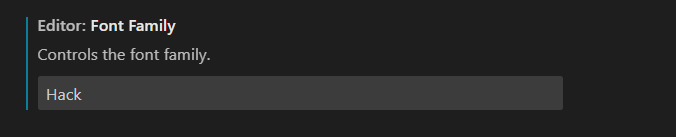
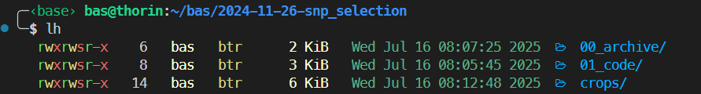
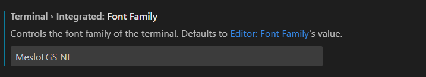

# Config
configuration files for various things:
- bashrc: bash config 
- zshrc: zshell config
- minttyrc: bash for windows
- vimrc: simple VIM config
- bash_aliases: commandline aliases
- tmux.conf: Tmux config for easy window hopping


## 1. Git config:
Git lg From https://coderwall.com/p/euwpig/a-better-git-log:


```bash
git config --global alias.lg "log --graph --pretty=format:'%Cred%h%Creset -%C(yellow)%d%Creset %s %Cgreen(%cr) %C(bold blue)<%an>%Creset' --abbrev-commit --date=relative"
```

## 2. Z for easy folder hopping
Install "z.sh" by copying the file somewhere in home and add it to the bashrc:

```bash
. ~/z.sh
```

## 3. Programming font
I like the [hack font](https://github.com/source-foundry/Hack) for programming because of the clear distinction of `lIi|` and `oO0Q`.


Configure VSCode (`Ctrl + ,`):




## 4. Setting up a pretty terminal

Like this:
*Screenshot:*


### 0. Install zshell first:
```bash
sudo apt-get install zsh
```

### 1. Install [oh-my-zsh](https://ohmyz.sh/#install):
```bash
sh -c "$(curl -fsSL https://raw.githubusercontent.com/ohmyzsh/ohmyzsh/master/tools/install.sh)"
```


### 2. Setting up the theme:
Place the zshell theme here: `$ZSH_CUSTOM/themes/`:
```bash
cp bas.zsh-theme $ZSH_CUSTOM/themes/
```

It shows in one glance: 

- which conda env
- git branch and if there are changes in the repo
- colorful ls
- New commands on a different line


### 3. Install ruby & colorls

```bash
# Requirement for later:
sudo apt-get install libyaml-dev

#Make environment folder
# (OPTIONAL: If disk space is an issue, make the folder somewhere else and symlink it)
mkdir ~/.rbenv

# Install ruby
git clone https://github.com/rbenv/rbenv.git ~/.rbenv
~/.rbenv/bin/rbenv init
rbenv install 3.4.5
```

Install `colorls`:
```
gem install --user-install colorls
```

**NOTE:** `ls` is aliased in the bash_aliases file (`alias ls='colorls'`). To unset: `unalias ls` (or change the config).

### 4. Install a font
To get the pretty icons in `colorls` we need to install a special font. To access settings in VSCode: "`Ctrl + ,`"



I got this font from here: [https://github.com/romkatv/powerlevel10k](https://github.com/romkatv/powerlevel10k?tab=readme-ov-file#meslo-nerd-font-patched-for-powerlevel10k)

You will need to install all four:
- MesloLGS NF Regular.ttf
- MesloLGS NF Bold.ttf
- MesloLGS NF Italic.ttf
- MesloLGS NF Bold Italic.ttf


